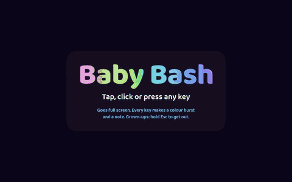

# Baby Bash

[](https://github.com/russellmorton/baby-bash/actions/workflows/test.yml)

A full-screen toy for babies who love to bash the keyboard. Every key or tap sets off a colour burst and plays a gentle synth note. Runs in any modern browser with nothing to install.

**Play it: https://baby-bash-azure.vercel.app**



- All notes are from C major pentatonic, so mashing always sounds musical.
- Each key always makes the same colour and sound, so cause and effect are easy to learn.
- Letters and digits appear large on screen. Space and Enter make a big burst and a chord.
- Every 10th bash gets a little extra, and it grows: a star ring at 10, a rainbow sweep at 25, a big sun, moon, heart or star floating up at 50, and fireworks at 100.
- Spell a word and it appears with a picture, lighting up letter by letter with a note each: **cat dog cow pig bee duck fish**, **sun moon star tree ball car**, **mama dada papa nana baby**, and the names **Jack, Quinn, Elizabeth**. Space, Enter or a 2.5 second pause starts a fresh word.
- Quiet master volume with a limiter. No strobing or white flashes.
- Goes full screen with keyboard lock on the first key press. **Grown-ups: hold Esc to exit, or on a touch screen hold the ✕ in the top corner.**

## Run it

Open `index.html` in a browser, or launch a dedicated full-screen Chromium window:

```sh
./baby-bash.sh
```

Desktop shortcuts handled by your window manager (for example Super-key bindings) can't be blocked by a web page.

## Tests

```sh
npm install
npm test            # headless Chromium: sound, visuals, input blocking, launcher
npm run test:perf   # frame rate under a burst storm (opens a visible window)
```

Tests use the system Chromium at `/usr/bin/chromium` when it exists (set `CHROMIUM_PATH` to use another), otherwise Playwright's own (`npx playwright install chromium`). CI runs `npm test` on every push. To test a deployed copy, set `APP_URL`, for example `APP_URL=https://baby-bash-azure.vercel.app npm test`.

## Deploy

Hosted on Vercel, which deploys every push to `main`. It's a single static page with no build step. `vercel.json` serves the repo root as-is and `.vercelignore` keeps tests and tooling out of the deployment.

## License

MIT. See [LICENSE](LICENSE).
